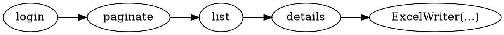

# Работа с Selenium

.. include:: _alpha.rst

Написание веб-краулеров с Bonobo и Selenium — это легко.

Сначала установите **bonobo-selenium**:

```shell-session
$ pip install bonobo-selenium
```

Идея заключается в том, чтобы один вызываемый объект сканировал одну вещь и делегировал углублённый поиск вызываемым объектам дальше в цепочке.

Примером цепочки может быть:



Где каждый шаг будет делать следующее:

* `login()` отвечает за открытие аутентифицированной сессии в браузере.
* `paginate()` открывает каждую страницу фиктивного списка и передаёт его следующему.
* `list()` берёт каждый элемент списка и выдаёт его.
* `details()` извлекает данные, которые вас интересуют.
* ... и средство записи сохраняет это где-то.

## Установка

## Обзор

## Подробности
