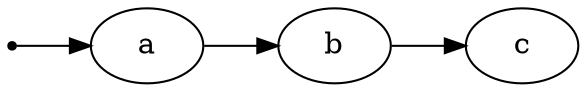
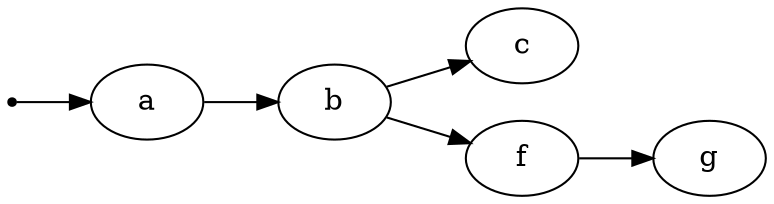
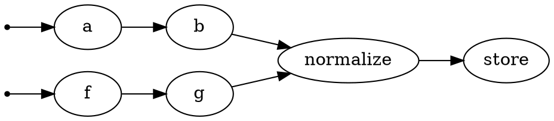
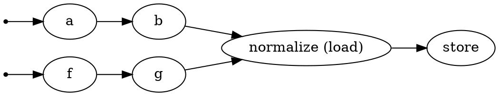

# Графы

Графы — это клей, который связывает преобразования вместе. Это единственная структура данных, которую bonobo может выполнять напрямую.

Графы должны быть ациклическими и могут содержать столько узлов, сколько может обработать ваша система. Однако, хотя в теории количество узлов может быть довольно высоким, практические случаи обычно не превышают несколько сотен узлов, и даже это — довольно большое число, которое вы можете не встретить так часто.

Внутри графа каждый узел изолирован и может общаться только с помощью своих входных и выходных очередей. Для каждой входной строки данный узел будет вызван со строкой, переданной в качестве аргументов. Каждое значение `return` или `yield` будет помещено в выходную очередь узла, и узлы, подключённые в графе, смогут затем обработать его.

|bonobo| — это решение для обработки потока данных строка за строкой.

Обработка потока данных таким способом приносит следующие свойства:

- **Первый пришёл — первым обслужен**: если не указано иное, каждый узел будет получать строки из FIFO-очередей, и, таким образом, порядок строк будет сохранён. Это верно для каждого отдельного узла, но, пожалуйста, обратите внимание, что если вы определяете "графовые пузыри" (где граф расходится на разные ветки, а затем снова сходится), узел слияния будет получать строки FIFO из каждой входной очереди, что означает, что порядок, существующий в точке расхождения, не останется верным в точке слияния.

- **Параллелизм**: каждый узел работает параллельно (по умолчанию, используя независимые потоки). Это полезно, так как вам не нужно беспокоиться о блокирующих вызовах. Если поток ждёт, скажем, базы данных или сетевого сервиса, другие узлы продолжат обрабатывать данные, пока у них есть доступные входные строки.

- **Независимость**: строки независимы друг от друга, что делает такой способ работы с потоками данных хорошим для обработки данных строка за строкой, но не идеальным для "групповых" вычислений (где вывод зависит от более чем одной строки входных данных). Вы можете преодолеть это с помощью скользящих окон, если требуемые входные данные — соседние строки, но если вам нужно работать со всем набором данных сразу, вам следует рассмотреть другое программное обеспечение.

Графы определяются с использованием экземпляров :class:`bonobo.Graph`, как было видно на предыдущем этапе руководства.

## Что можно использовать как узел?

**Коротко:** … что угодно, пока это callable() или итерируемый объект.

### Функции

```python
def get_item(id):
    return id, items.get(id)
```

При построении графа вы можете просто добавить свою функцию:

```python
graph.add_chain(..., get_item, ...)
```

Или используя новый синтаксис:

```python
graph >> ... >> get_item >> ...
```

> **Примечание**
>
> Обратите внимание, что мы передаём объект функции, а не результат вызова функции. Распространённая ошибка — вызывать функцию при построении графа, что не будет работать и может быть утомительно для отладки.
>
> По соглашению мы используем объекты в snake_case, когда объект можно напрямую передать в граф, как эта функция.
>
> Некоторые функции являются фабриками для замыканий и, таким образом, ведут себя иначе (так как вам нужно вызвать их, чтобы получить фактический объект, который можно использовать как преобразование). Когда это так, мы используем CamelCase как соглашение, так как это ведёт себя так же, как класс.

### Классы

```python
class Foo:
    ...

    def __call__(self, id):
        return id, self.get(id)
```

При построении графа вы можете добавить экземпляр вашего объекта (или даже несколько экземпляров, в конечном итоге сконфигурированных по-разному):

```python
graph.add_chain(..., Foo(), ...)
```

Или используя новый синтаксис:

```python
graph >> ... >> Foo() >> ...
```

### Итерируемые объекты (генераторы, списки, ...)

В качестве удобного инструмента мы можем использовать итерируемые объекты напрямую внутри графа. Они могут использоваться как производящие узлы (узлы, которые обычно вызываются только один раз и производят данные) или, в случае генераторов, как преобразования.

```python
def product(x):
    for i in range(10)
        yield x, i, x * i
```

Затем добавьте его в граф:

```python
graph.add_chain(range(10), product, ...)
```

Или используя новый синтаксис:

```python
graph >> range(10) >> product >> ...
```

### Встроенные функции

Снова, пока это вызываемый объект, вы можете использовать его как узел. Это означает, что встроенные функции Python работают (подумайте о `print` или `str.upper`...)

```python
graph.add_chain(range(ord("a"), ord("z")+1), chr, str.upper, print)
```

Или используя новый синтаксис:

```python
graph >> range(ord("a"), ord("z")+1) >> chr >> str.upper >> print
```

## Что происходит во время выполнения графа?

Каждый узел графа будет выполняться в изоляции от других узлов, и данные передаются от одного узла к следующему, используя FIFO-очереди, управляемые фреймворком. Однако это прозрачно для конечного пользователя, и вы будете использовать только аргументы функции (для входов) и значения return/yield (для выходов).

Каждая входная строка узла вызовет один вызов вызываемого объекта этого узла. Каждый вывод внутренне приводится к структуре данных, подобной кортежу (или, точнее, к структуре данных, подобной именованному кортежу), и для одного данного узла каждая выходная строка должна иметь одинаковую структуру.

Если вы вернёте/выдаёте что-то, что не является кортежем, bonobo создаст кортеж из одного элемента.

### Свойства

|bonobo| помогает вам определять поток данных вашего процесса инженерии данных, а затем передаёт данные через ваши вызываемые графы.

* Каждый вызов узла будет обрабатывать одну строку данных.
* Очереди, которые передают данные между узлами, — это стандартные FIFO-очереди Python :class:`queue.Queue` (первый пришёл — первым обслужен).
* Каждый узел будет работать параллельно.
* Стратегия выполнения по умолчанию использует потоковую обработку, и каждый узел будет работать в отдельном потоке.

### Отказоустойчивость

Выполнение узла отказоустойчиво.

Если исключение возникает из вызова узла, то этот вызов узла будет прерван, но bonobo продолжит выполнение со следующей строкой (после вывода стека трассировки и увеличения счётчика "err" для контекста узла).

Это позволяет иметь ETL-задания, которые игнорируют неисправные данные и стараются изо всех сил обработать допустимые строки набора данных.

Однако некоторые ошибки являются фатальными.

Если вы передаёте кортеж из 2 элементов в узел, который принимает 3 аргумента, |bonobo| вызовет :class:`bonobo.errors.UnrecoverableTypeError` и выйдет из текущего выполнения графа как можно быстрее (завершив другие выполнения узлов, которые находятся в процессе, но не начиная новых, если есть оставшиеся входные строки).

### Определения

**Граф**

Ориентированный ациклический граф преобразований, который Bonobo может инспектировать и выполнять.

**Узел**

Преобразование внутри графа. Преобразования без состояния и не имеют понятия, включены ли они в граф, несколько графов или вообще нет.

## Построение графов

Графы в |bonobo| — это экземпляры :class:`bonobo.Graph`.

Графы должны быть экземплярами :class:`bonobo.Graph`. Метод :func:`bonobo.Graph.add_chain` может принимать столько позиционных параметров, сколько вы хотите.

> **Примечание**
>
> Начиная с |bonobo| 0.7, доступен новый синтаксис, который, мы считаем, более мощный и более читаемый, чем устаревший метод `add_chain`. Прежний API останется, и его совершенно безопасно использовать (фактически, новый синтаксис использует `add_chain` под капотом).
>
> Если это вариант для вас, мы предлагаем вам рассмотреть новый синтаксис. В течение переходного периода мы будем документировать оба, но новый синтаксис в конечном итоге станет стандартным.

```python
import bonobo

graph = bonobo.Graph()
graph.add_chain(a, b, c)
```

Или используя новый синтаксис:

```python
import bonobo

graph = bonobo.Graph()
graph >> a >> b >> c
```

Полученный граф:



## Нелинейные графы

### Расхождения / развилки

Чтобы создать два или более расходящихся потока данных ("развилки"), вы должны указать параметр `_input` в `add_chain`.

```python
import bonobo

graph = bonobo.Graph()
graph.add_chain(a, b, c)
graph.add_chain(f, g, _input=b)
```

Или используя новый синтаксис:

```python
import bonobo

graph = bonobo.Graph()
graph >> a >> b >> c
graph.get_cursor(b) >> f >> g
```

Полученный граф:



> **Примечание** Обе ветки получат одни и те же данные и одновременно.

### Слияния

Чтобы объединить два потока данных, вы можете использовать параметр `_output` в `add_chain` или использовать именованные узлы (см. ниже).

```python
import bonobo

graph = bonobo.Graph()

# Здесь мы устанавливаем _input в None, поэтому normalize не начнётся самостоятельно, а только после того, как получит ввод из других цепочек.
graph.add_chain(normalize, store, _input=None)

# Добавляем две разные цепочки
graph.add_chain(a, b, _output=normalize)
graph.add_chain(f, g, _output=normalize)
```

Или используя новый синтаксис:

```python
import bonobo

graph = bonobo.Graph()

# Здесь мы устанавливаем _input в None, поэтому normalize не начнётся самостоятельно, а только после того, как получит ввод из других цепочек.
graph.get_cursor(None) >> normalize >> store

# Добавляем две разные цепочки
graph >> a >> b >> normalize
graph >> f >> g >> normalize
```

Полученный граф:



> **Примечание**
>
> Это не "join" или "декартово произведение". Любые данные, которые приходят из `b` или `g`, пройдут через `normalize`, по одному за раз. Думайте о рёбрах графа как о трубах потока данных.

### Именованные узлы

Использование вышеуказанного кода для создания слияний часто приводит к коду, который трудно читать, потому что вы должны определить "целевой" поток перед потоками, которые логически идут к началу графа преобразований. Чтобы преодолеть это, можно использовать "именованные" узлы.

Обратите внимание, что именование цепочки — это то же самое, что и именование первого узла цепочки.

```python
import bonobo

graph = bonobo.Graph()

# Здесь мы отмечаем _input как None, поэтому normalize не получит импульс "begin".
graph.add_chain(normalize, store, _input=None, _name="load")

# Добавляем две разные цепочки, которые будут выводиться в узел "load"
graph.add_chain(a, b, _output="load")
graph.add_chain(f, g, _output="load")
```

Используя новый синтаксис, не должно быть необходимости именовать узлы. Дайте нам знать, если вы думаете иначе, создав issue.

Полученный граф:



Вы также можете создавать отдельные узлы, и API предоставляет ту же возможность на отдельных узлах.

```python
import bonobo

graph = bonobo.Graph()

# Создаём узел без каких-либо подключений, называем его.
graph.add_node(foo, _name="foo")

# Используем его где-то ещё как источник данных.
graph.add_chain(..., _input="foo")

# ... или как приёмник данных.
graph.add_chain(..., _output="foo")
```

### Сиротские узлы / цепочки

Поведение по умолчанию `add_chain` (или `get_cursor`) — подключить первый узел к специальному токену `BEGIN`, который инструктирует |bonobo| вызвать подключённый узел один раз без параметров для запуска потока данных.

Обычно это то, что вы хотите, но есть способы переопределить это, так как вы можете захотеть добавить "сиротские" узлы или цепочки в ваш граф.

```python
import bonobo

graph = bonobo.Graph()

# использование add_node естественно добавит узел как "сиротский"
graph.add_node(a)

# использование add_chain с "None" в качестве входа создаст сиротскую цепочку
graph.add_chain(a, b, c, _input=None)

# используя новый синтаксис, вы можете использовать либо get_cursor(None), либо ярлык orphan()
graph.get_cursor(None) >> a >> b >> c

# ... используя ярлык ...
graph.orphan() >> a >> b >> c
```

### Подключение двух узлов

Вам может понадобиться подключить два узла в какой-то момент. Вы можете использовать `add_chain` без узлов для достижения этого.

```python
import bonobo

graph = bonobo.Graph()

# Создаём два "анонимных" узла
graph.add_node(a)
graph.add_node(b)

# Подключаем их
graph.add_chain(_input=a, _output=b)
```

Или используя новый синтаксис:

```python
graph.get_cursor(a) >> b
```

### Курсоры

Курсоры — это простые структуры, которые ссылаются на граф, начальную точку и конечную точку. Они могут использоваться для манипулирования графами с помощью оператора `>>` интуитивно понятным способом.

Чтобы получить курсор из графа, у вас есть разные варианты:

```python
# самый очевидный способ получить курсор, его начальная точка будет "BEGIN"
cursor = graph.get_cursor()

# то же самое, явно
cursor = graph.get_cursor(BEGIN)

# если вы пытаетесь использовать граф с оператором `>>`, он создаст курсор для вас, от "BEGIN"
cursor = graph >> ...  # то же самое, что `graph.get_cursor(BEGIN) >> ...`

# получить курсор, указывающий на ничего
cursor = graph.get_cursor(None)

# ... или более читаемым способом
cursor = graph.orphan()
```

Как только вы получили курсор, вы можете использовать его для добавления узлов, объединения его с другими курсорами и т.д. Каждый раз, когда вы вызываете что-то, что должно привести к изменённому курсору, вы получите новый экземпляр, поэтому ваш старый курсор всё ещё будет доступен, если он вам нужен.

```python
c1 = graph.orphan()

# добавляем узел, получаем новый курсор
c2 = c1 >> node1

# создаём сиротскую цепочку
c3 = graph.orphan() >> normalize

# объединяем цепочку с существующим курсором
c4 = c2 >> c3
```

## Инспектирование графов

Bonobo поставляется с "инспектором", который может использовать graphviz для визуализации ваших графов.

Прочитайте [Как инспектировать и визуализировать ваш граф](https://www.bonobo-project.org/how-to/inspect-an-etl-jobs-graph).

## Выполнение графов

Есть два варианта выполнения графа (которые имеют похожий результат, но нацелены на различные варианты использования).

* Вы можете использовать интерфейс командной строки bonobo, который является интерфейсом самого высокого уровня.
* Вы можете использовать Python API, который является более низким уровнем, но позволяет использовать bonobo из вашего собственного кода (например, команды управления django).

### Выполнение графа с интерфейсом командной строки

Если нет веской причины не делать этого, вы должны использовать `bonobo run ...` для выполнения графов преобразований, найденных в ваших файлах исходного кода Python.

```shell
$ bonobo run file.py
```

Вы также можете запустить модуль Python:

```shell
$ bonobo run -m my.own.etlmod
```

В каждом случае CLI bonobo будет искать экземпляр :class:`bonobo.Graph` в вашем файле/модуле, создавать необходимую сантехнику для его выполнения и запускать его.

Если вы в интерактивном контексте терминала, он будет использовать :class:`bonobo.ext.console.ConsoleOutputPlugin` для отображения.

Если вы в контексте записной книжки Jupyter, он (попытается) использовать :class:`bonobo.ext.jupyter.JupyterOutputPlugin`.

### Выполнение графа с использованием внутреннего API

Для интеграции выполнения bonobo в любой другой код Python вы должны использовать :func:`bonobo.run`. Он ведёт себя очень похоже на CLI, и читая исходный код, вы должны легко разобраться с его использованием.
