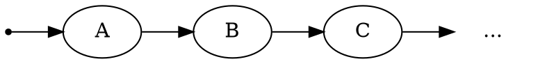
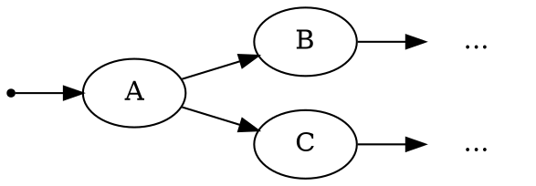
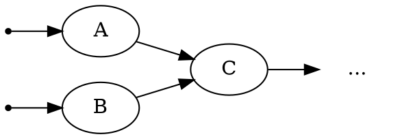

# Введение

Первое, что вам нужно понять перед использованием |bonobo| или нет, — это то, что он делает и чего не делает, чтобы вы могли понять, подходит ли он для ваших вариантов использования.

## Как это работает?

**Bonobo** — это **Extract Transform Load** (извлечение-преобразование-загрузка) фреймворк, предназначенный для программистов, хакеров или любых других людей, которые чувствуют себя комфортно с терминалами и файлами исходного кода.

Это решение для **потоковой обработки данных**, которое обрабатывает наборы данных как упорядоченные коллекции независимых строк, позволяя обрабатывать их "первым пришёл — первым обслужен" (first in, first out) с помощью набора преобразований, организованных вместе в ориентированном графе.

Давайте рассмотрим несколько примеров.

### Простейший линейный граф

Один из самых простых, по книге, случаев — это извлекающий узел, отправляющий данные в преобразование, которое само отправляет их в загружающий узел (отсюда и название "Extract Transform Load").

> **Примечание**
>
> Конечно, |bonobo| нацелен на реальные преобразования данных и может помочь вам построить всевозможные потоки данных.

Bonobo отправит "импульс" всем преобразованиям, связанным с узлом `BEGIN` (показанным как маленькая чёрная точка слева).

В нашем примере единственный узел, чей вход связан с `BEGIN`, — это `A`.

Главная тема `A` будет заключаться в извлечении данных откуда-то (файл, endpoint, база данных...) и генерации некоторого вывода. Как только первая строка вывода `A` будет доступна, |bonobo| начнёт просить `B` обработать её. Как только первая строка вывода `B` будет доступна, |bonobo| начнёт просить `C` обработать её.

Пока `B` и `C` обрабатывают, `A` продолжает генерировать данные.

Этот подход может быть эффективным в зависимости от ваших требований, потому что вы можете полагаться на множество сервисов, которые могут долго отвечать или быть ненадёжными, и вам не нужно самостоятельно обрабатывать оптимизацию, параллелизм или логику повторных попыток.

> **Примечание**
>
> Стратегия выполнения по умолчанию использует потоки и делает эффективной работу с задачами, ограниченными вводом-выводом. В планах есть другие стратегии выполнения, основанные на подпроцессах (для задач, ограниченных CPU) или `dask.distributed` (для задач с большими данными, которые требуют кластера компьютеров для обработки за разумное время).

### Графы с точками расхождения (или развилками)

В этом случае любая выходная строка `A` будет **отправлена в оба** `B` и `C` одновременно. Снова, `A` продолжит свою обработку, пока `B` и `C` работают.

### Граф с точками слияния

Теперь мы подаём данные в `C` из вывода как `A`, так и `B`. Это не "join" или "декартово произведение". Это просто две разные трубы, подключённые к входу `C`, и любой из них, который выдаёт данные, увидит, что эти данные подаются в `C`, по одной строке за раз.

## Чем это не является?

|bonobo| не является:

* Инструментом для науки о данных или статистического анализа, который должен обрабатывать весь набор данных как единое целое, а не как коллекцию независимых строк. Если это ваша потребность, вам, вероятно, стоит посмотреть на [pandas](https://pandas.pydata.org/).

* Решением для рабочих процессов или планирования независимых задач по инженерии данных. Если вы хотите управлять своими наборами задач по обработке данных как единым целым, вам, вероятно, стоит посмотреть на [Airflow](https://airflow.incubator.apache.org/). Хотя пока нет расширения |bonobo|, которое обрабатывает это, имеет смысл интегрировать задания |bonobo| в рабочий процесс airflow (или другого подобного инструмента).

* Решением для больших данных, [как определено в Википедии](https://en.wikipedia.org/wiki/Big_data). Мы нацеливаемся на обработку данных "небольшого масштаба", что может быть всё ещё довольно огромным для людей, но не для компьютеров. Если вы не знаете, достаточно ли этого для ваших потребностей, это, вероятно, означает, что вы не в мире "больших данных".
