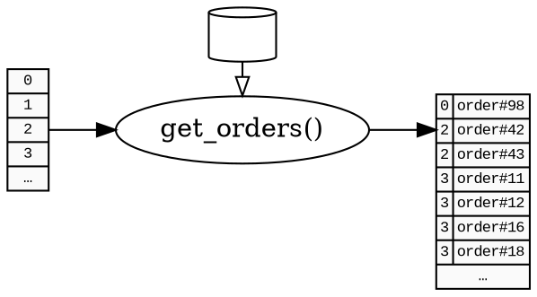
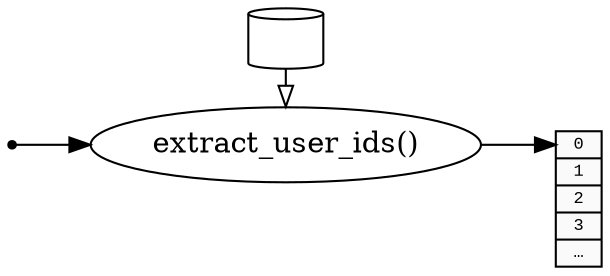
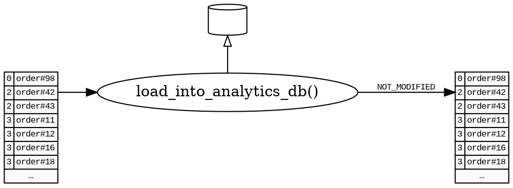
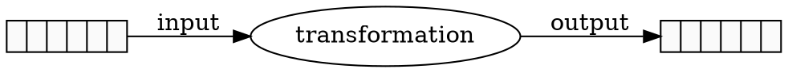

# Преобразования

Преобразования — это самые маленькие строительные блоки в |bonobo|.

Нет специальной структуры данных, используемой для представления преобразований, это в основном просто обычный вызываемый объект Python (callable), или даже итерируемый объект (если он не требует входных данных).

В графе преобразования становятся узлами, и поток данных между ними описывается с помощью рёбер.

> **Примечание**
>
> В этой главе мы будем считать, что в любой момент, когда нам нужна "база данных", это что-то, что мы можем получить из глобального пространства имён. Эта практика приемлема для небольших заданий, но не в масштабе.
>
> Вы узнаете в [Сервисах](services.md), как правильно управлять внешними зависимостями.

## Типы преобразований

### Общий случай

**Общий случай** — это преобразование, которое выдаёт n выходных данных для каждого входного.

Вы можете реализовать его, используя генератор:

```python
db = ...

def get_orders(user_id):
    for order in db.get_orders(user_id):
        yield user_id, order
```



*Здесь каждая строка (содержащая идентификатор пользователя) будет преобразована в набор строк, каждая из которых содержит user_id и объект "order".*

### Случай извлечения

**Извлекающий узел (extractor)** — это преобразование, которое генерирует вывод, не используя никакого ввода. Обычно он не генерирует эти данные из ниоткуда, а вместо этого подключается к внешней системе (база данных, API, HTTP, файлы...) для чтения данных оттуда.

Он может быть реализован двумя различными способами.

* Вы можете реализовать его, используя генератор, как в общем случае:

```python
db = ...

def extract_user_ids():
    yield from db.select_all_user_ids()
```



* Вы также можете использовать итератор напрямую:

```python
import bonobo

db = ...

def get_graph():
    graph = bonobo.Graph()
    graph.add_chain(
        db.select_all_user_ids(),
        ...
    )
    return graph
```

Это очень удобно во многих случаях, когда ваша существующая система уже имеет интерфейс, который даёт вам итераторы.

> **Примечание**
>
> Важно использовать генерирующий подход, который выдаёт данные по мере их поступления, а не генерирует всё сразу перед возвратом, чтобы |bonobo| мог передавать данные следующим узлам, как только начнётся потоковая передача.

### Случай загрузки

**Загружающий узел (loader)** — это преобразование, которое отправляет свои входные данные во внешнюю систему. Для идеальной симметрии с извлекающими узлами мы хотели бы не иметь никакого вывода, но для удобства и потому что это имеет пренебрежимо малую стоимость в |bonobo|, соглашение заключается в том, что все загружающие узлы возвращают :obj:`bonobo.constants.NOT_MODIFIED`, что означает, что все строки, которые поступили на вход этого узла, также поступят на его выходы без изменений. Это позволяет связывать преобразования даже после того, как произошла загрузка, и избегать использования трюков для достижения того же самого:

```python
from bonobo.constants import NOT_MODIFIED

analytics_db = ...

def load_into_analytics_db(user_id, order):
    analytics_db.insert_or_update_order(user_id, order['id'], order['amount'])
    return NOT_MODIFIED
```



## Контекст выполнения

Преобразования, являясь обычными функциями, требуют немного механизма для использования их как узлов в потоковом потоке.

Когда :class:`bonobo.Graph` выполняется, каждый узел оборачивается в :class:`bonobo.execution.contexts.NodeExecutionContext`, который отвечает за сохранение состояния узла в рамках данного выполнения.

## Входы и выходы

При выполнении в контексте выполнения преобразования имеют входы и выходы, что означает, что |bonobo| будет передавать данные, поступающие во входную очередь, как вызовы, и помещать возвращённые/выданные значения в выходную очередь.



Для стратегий на основе потоков базовой реализацией входных и выходных очередей является стандартный :class:`queue.Queue`.

### Входы

Весь ввод извлекается через аргументы вызова. Каждая строка ввода означает один вызов предоставленного вызываемого объекта. Аргументы будут, в порядке:

* Внедрённые зависимости (база данных, HTTP, файловая система, ...)
* Позиционные аргументы
* Именованные аргументы

Ниже вы увидите, как передать каждый из них.

### Выходы

Каждый вызываемый объект может возвращать/выдавать различные вещи (все примеры будут использовать yield, но если есть только один вывод на строку ввода, вы также можете вернуть свою выходную строку и ожидать точно такого же поведения).

Логика определена в этом куске кода, документация будет добавлена в ближайшее время:

```python
# bonobo/execution/contexts/node.py
# NodeExecutionContext._cast(self, _input, _output)
```

В основном, после проверки нескольких флагов (`NOT_MODIFIED`, затем `INHERIT`), он "приведёт" данные к "типу вывода", который является либо кортежем, либо своего рода именованным кортежем.

## Преобразования на основе классов

Для вариантов использования, которые либо менее просты, либо требуют лучшей повторной используемости, вы можете захотеть использовать классы для определения некоторых из ваших преобразований.

См.:

* :class:`bonobo.config.Configurable`
* :class:`bonobo.config.Option`
* :class:`bonobo.config.Service`
* :class:`bonobo.config.Method`
* :class:`bonobo.config.ContextProcessor`

## Соглашения об именовании

Используемое соглашение об именовании следующее.

Если вы называете что-то, что является фактическим преобразованием, которое можно использовать напрямую как узел графа, используйте подчёркивания и имена в нижнем регистре:

```python
# экземпляр преобразования на основе класса
filter = Filter(...)

# преобразование на основе функции
def uppercase(s: str) -> str:
    return s.upper()
```

Если вы называете что-то, что настраиваемо, что нужно создать или вызвать, чтобы получить что-то, что можно использовать как узел графа, используйте имена в CamelCase:

```python
# настраиваемый
class ChangeCase(Configurable):
    modifier = Option(default='upper')
    def __call__(self, s: str) -> str:
        return getattr(s, self.modifier)()

# фабрика преобразований
def Apply(method):
    @functools.wraps(method)
    def apply(s: str) -> str:
        return method(s)
    return apply

# результат — кандидат на узел графа
upper = Apply(str.upper)
```

## Тестирование

Поскольку Bonobo использует обычные старые объекты Python как преобразования, очень легко модульно тестировать ваши преобразования, используя ваш любимый фреймворк тестирования. Мы используем pytest внутри Bonobo, но это зависит от вас, какой использовать.

Если вы хотите протестировать преобразование с предоставленным окружающим контекстом (например, внедрёнными экземплярами сервисов и применёнными контекстными процессорами), вы можете использовать :class:`bonobo.execution.NodeExecutionContext` как контекстный процессор и позволить bonobo отправлять данные в ваше преобразование.

```python
from bonobo.execution import NodeExecutionContext

with NodeExecutionContext(
    JsonWriter(filename), services={'fs': ...}
) as context:
    # Записать список строк, включая управляющие сообщения BEGIN/END.
    context.write_sync(
        {'foo': 'bar'},
        {'foo': 'baz'},
    )
```
