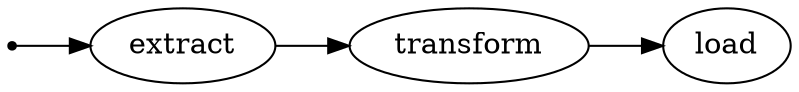

# Часть 1: Начнём!

Чтобы начать работу с |bonobo|, вам нужно установить его в рабочей среде Python 3.5+ (вам следует использовать [virtualenv](https://virtualenv.pypa.io/)).

```shell
$ pip install bonobo
```

Проверьте, что установка прошла успешно, и что вы используете версию, соответствующую этому руководству (написанному для bonobo |longversion|).

```shell
$ bonobo version
```

См. [Установка](../install.md) для получения дополнительных вариантов.

## Создайте ETL-задание

Начиная с Bonobo 0.6, легко создать простое ETL-задание, используя всего один файл.

Мы начнём здесь, а следующие этапы руководства проведут вас к рефакторингу этого в Python-пакет.

```shell
$ bonobo init tutorial.py
```

Это создаст простое задание в файле `tutorial.py`. Давайте запустим его:

```shell
$ python tutorial.py
Hello
World
 - extract in=1 out=2 [done]
 - transform in=2 out=2 [done]
 - load in=2 [done]
```

Поздравляем! Вы только что запустили своё первое ETL-задание |bonobo|.

## Инспектируйте свой граф

Базовые строительные блоки |bonobo| — это **преобразования** и **графы**.

**Преобразования** — это простые вызываемые объекты Python (как функции), которые обрабатывают этап преобразования для строки данных.

**Графы** — это набор преобразований с направленными связями между ними, определяющими поток данных, который будет происходить во время выполнения.

Чтобы инспектировать граф вашего первого преобразования:

> **Примечание**
>
> Вы должны [сначала установить программное обеспечение graphviz](https://www.graphviz.org/download/). Это **не** пакет graphviz для Python, вы должны установить его с помощью диспетчера пакетов вашей системы (apt, brew и т.д.).
>
> Для пользователей Windows: вам может потребоваться добавить запись в переменную среды Path, чтобы команда `dot` была распознана.

```shell
$ bonobo inspect --graph tutorial.py | dot -Tpng -o tutorial.png
```

Откройте сгенерированный файл `tutorial.png`, чтобы быстро взглянуть на граф.



Здесь вы легко можете понять структуру своего графа. Для такого простого графа это практически бесполезно, но по мере того, как вы будете писать более сложные преобразования, это будет полезно.

## Чтение кода

Прежде чем мы напишем своё собственное задание, давайте посмотрим на код, который у нас есть в `tutorial.py`.

### Импорт

```python
import bonobo
```

API самого высокого уровня |bonobo| содержатся в пространстве имён верхнего уровня **bonobo**.

Если вы новичок в библиотеке, придерживайтесь использования только этих API (они также являются самыми стабильными API).

Если вы продвинутый пользователь (и вы им станете довольно скоро), вы можете безопасно использовать API второго уровня.

API третьего уровня считаются закрытыми, и вы не должны использовать их, если не взламываете |bonobo| напрямую.

### Извлечение

```python
def extract():
    yield 'hello'
    yield 'world'
```

Это первое преобразование, написанное как [генератор Python](https://docs.python.org/3/glossary.html#term-generator), который будет отправлять некоторые строки одну за другой на свой вывод.

Преобразования, которые не принимают ввод и выдают переменное количество выходных данных, обычно называются **извлекающими узлами**. Вы встретите несколько различных типов: либо чисто генерирующие данные (как здесь), либо использующие внешний сервис (базу данных, например), либо использующие некоторую файловую систему (которая также считается внешним сервисом).

Извлекающим узлам не нужно подключать свой ввод к чему-либо, и они будут вызваны ровно один раз при выполнении графа.

### Преобразование

```python
def transform(*args):
    yield tuple(
        map(str.title, args)
    )
```

Это второе преобразование. Оно будет вызвано несколько раз, по одному разу для каждой входной строки, которую оно получает, и применит некоторую логику к вводу для генерации вывода.

Это самый **универсальный** случай. Для каждой входной строки вы можете генерировать ноль, одну или много строк вывода для каждой строки ввода.

### Загрузка

```python
def load(*args):
    print(*args)
```

Это третье и последнее преобразование в нашем примере "hello world". Оно применит некоторую логику к каждой строке и вообще не будет иметь вывода.

Преобразования, которые принимают ввод и ничего не выдают, также называются **загружающими узлами**. Как и извлекающие узлы, вы встретите различные типы для работы с различными внешними системами.

Обратите внимание, что для удобства и поскольку затраты минимальны, большинство встроенных **загружающих узлов** будут отправлять свои входные данные на свой вывод без изменений, чтобы вы могли легко связать более одного загружающего узла или применить больше преобразований после данного загружающего узла.

### Фабрика графа

```python
def get_graph(**options):
    graph = bonobo.Graph()
    graph.add_chain(extract, transform, load)
    return graph
```

Все наши преобразования были определены выше, но пока ничего не связывает их вместе.

Эта функция "фабрика графа" отвечает за создание и настройку экземпляра `bonobo.Graph`, который будет выполнен позже.

Никоим образом |bonobo| не ограничивается простыми графами, как этот. Вы можете добавить столько цепочек, сколько хотите, и каждая цепочка может содержать столько узлов, сколько хотите.

### Фабрика сервисов

```python
def get_services(**options):
    return {}
```

Это "фабрика сервисов", которую мы будем использовать позже для подключения к внешним системам. Давайте пока пропустим её.

(мы погрузимся в эту тему в [Части 4: Сервисы](4-services.md))

### Основной блок

```python
if __name__ == '__main__':
    parser = bonobo.get_argument_parser()
    with bonobo.parse_args(parser) as options:
        bonobo.run(
            get_graph(**options),
            services=get_services(**options)
        )
```

Здесь происходит самое главное.

Не вдаваясь пока в слишком много деталей, использование контекстного менеджера `bonobo.parse_args` позволит сделать наше задание настраиваемым позже, и хотя нам это сейчас действительно не нужно, это тоже не вредит.

> **Примечание**
>
> Это предназначено для запуска в консольном терминале. Если вы работаете в записной книжке Jupyter, вам нужно адаптировать это, чтобы избежать попыток разбора аргументов, иначе у вас возникнут проблемы.

## Чтение вывода

Давайте запустим это задание ещё раз:

```shell
$ python tutorial.py
Hello
World
 - extract in=1 out=2 [done]
 - transform in=2 out=2 [done]
 - load in=2 [done]
```

Вывод в консоль содержит две вещи.

* Во-первых, он содержит реальный вывод вашего задания (то, что было :func:`print`-ано в `sys.stdout`).
* Во-вторых, он отображает статус выполнения (в `sys.stderr`). Каждая строка содержит символ "статус", имя узла, числа и понятный человеку статус. Этот статус будет меняться в реальном времени и позволяет понять прогресс задания во время его выполнения.

  * Символ статуса:
    * " " означает, что узел ещё не запущен.
    * "`-`" означает, что узел завершил своё выполнение.
    * "`+`" означает, что узел сейчас работает.
    * "`!`" означает, что у узла были проблемы при выполнении.

  * Числовая статистика:
    * "`in=...`" показывает количество входных строк, также известное как количество вызовов вашего преобразования.
    * "`out=...`" показывает количество выходных строк.
    * "`read=...`" показывает количество чтений, применённых к внешней системе, если преобразование поддерживает это.
    * "`write=...`" показывает количество записей, применённых к внешней системе, если преобразование поддерживает это.
    * "`err=...`" показывает количество исключений, произошедших во время выполнения преобразования. Обратите внимание, что исключение прервёт вызов, но выполнение перейдёт к следующей строке.

Однако, если вы запустите tutorial.py, это происходит слишком быстро, и вы не можете увидеть изменение статуса. Давайте добавим некоторые задержки в ваш код.

В начале tutorial.py добавьте новый импорт и добавьте некоторые задержки к 3 этапам:

```python
import time

def extract():
    """Placeholder, change, rename, remove... """
    time.sleep(5)
    yield 'hello'
    time.sleep(5)
    yield 'world'


def transform(*args):
    """Placeholder, change, rename, remove... """
    time.sleep(5)
    yield tuple(
        map(str.title, args)
    )


def load(*args):
    """Placeholder, change, rename, remove... """
    time.sleep(5)
    print(*args)
```

Теперь запустите tutorial.py снова, и вы можете увидеть изменение статуса во время процесса.

## Подведение итогов

Это всё для этого первого шага.

Теперь вы знаете:

* Как создать новое задание (используя один файл).
* Как инспектировать содержимое задания.
* Что должно быть в файле задания.
* Как выполнить файл задания.
* Как читать вывод в консоли.

Теперь пришло время перейти к [Части 2: Задания](2-jobs.md).
